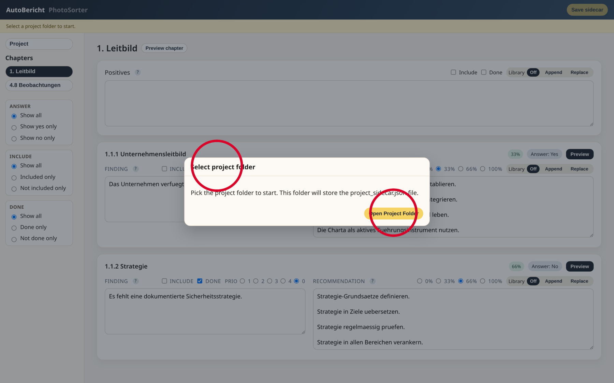
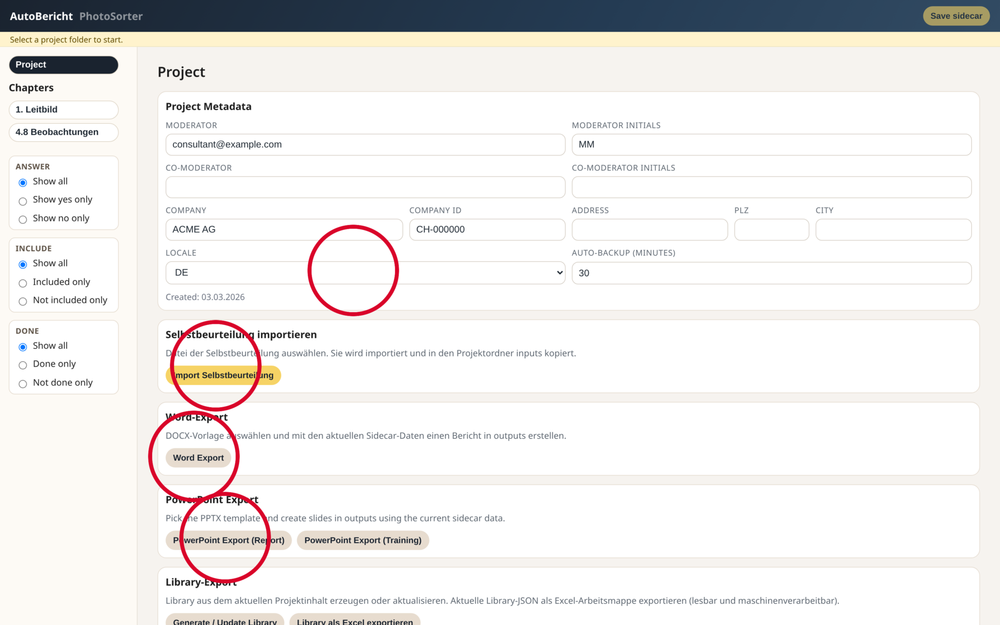
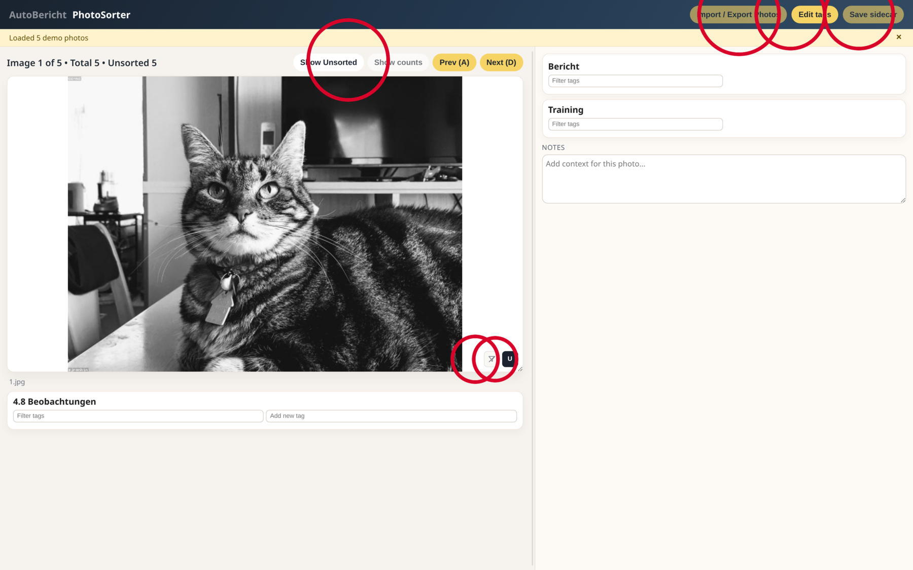
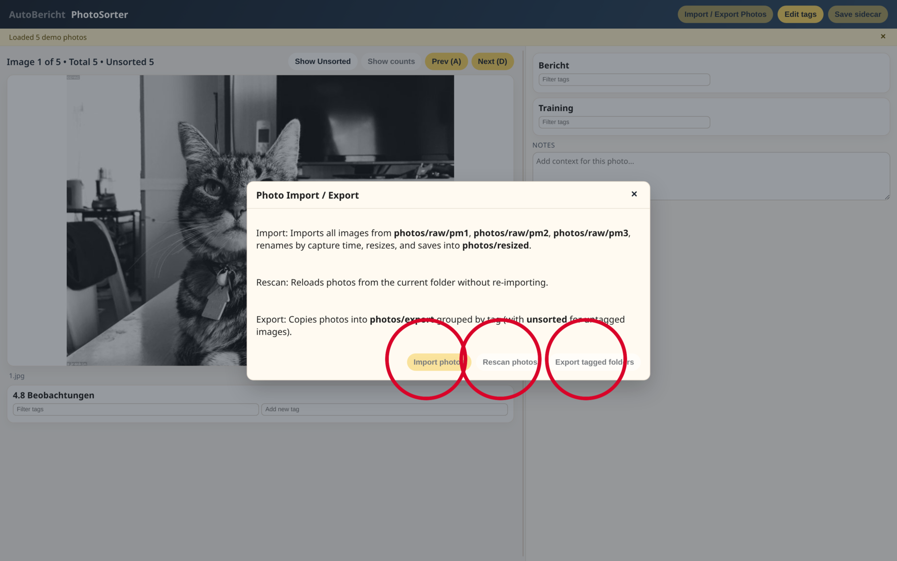
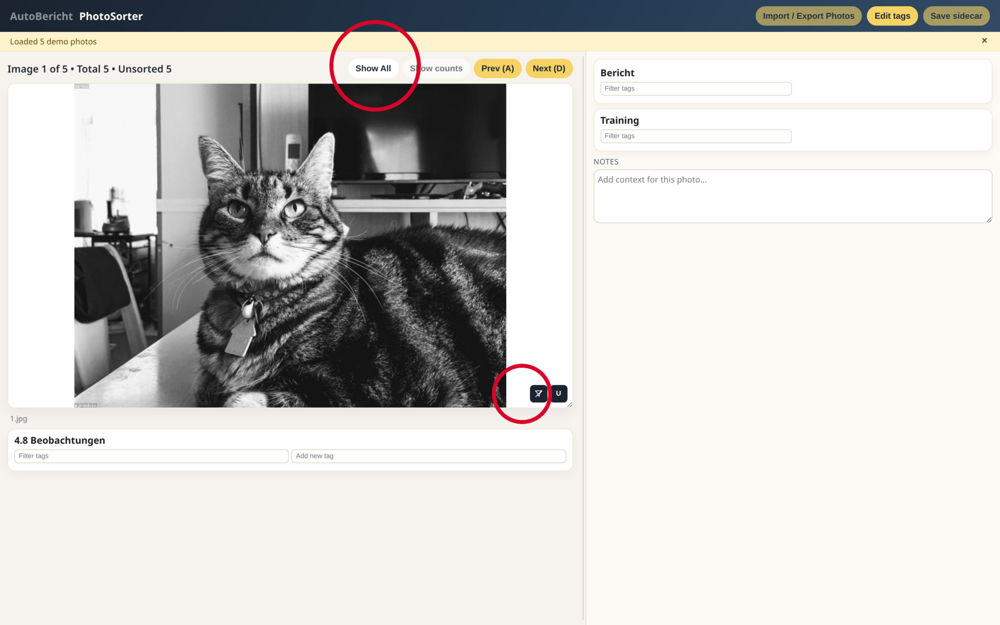
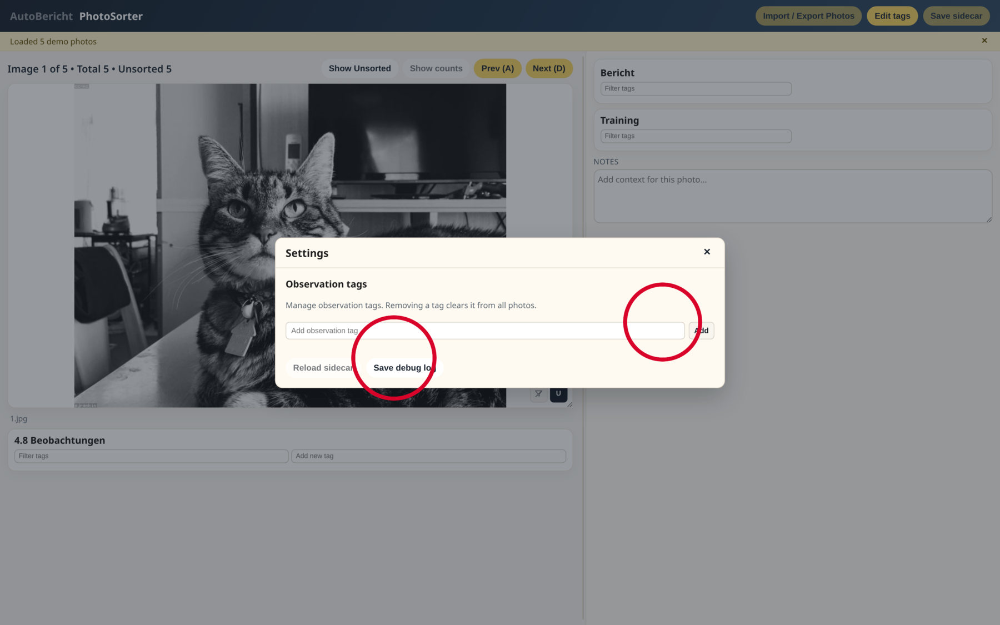
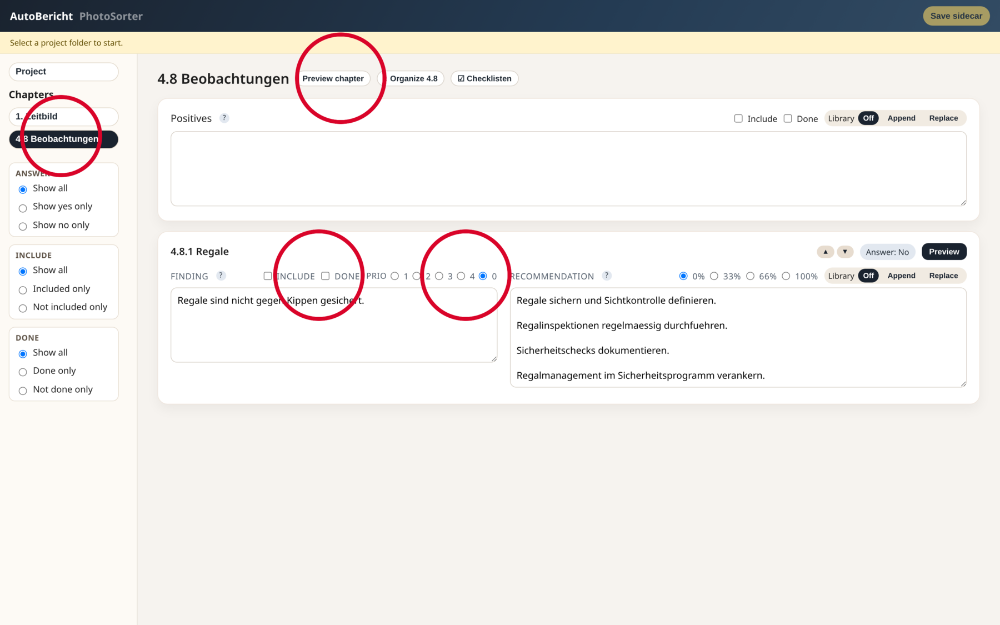
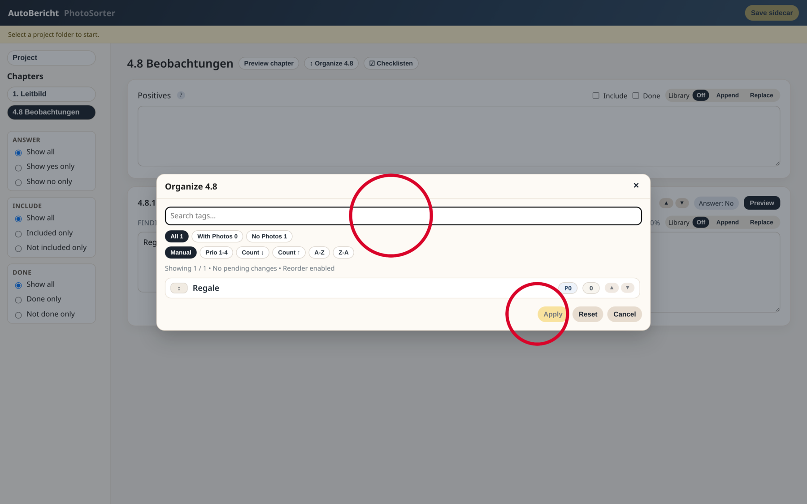

# AutoBericht Guide Rapide (FR)

Ce guide est destiné à des utilisateurs techniques. Les libellés de l'interface restent en **anglais** (comme dans l'application).

## 1) Préparer le repo et le dossier projet
1. Crée un dossier repo, par ex. `C:\AutoBericht`.
2. Crée un dossier projet vide, par ex. `C:\Projet_X`.
3. Copie le repo complet dans `C:\AutoBericht`.
4. Lance `start-autobericht.cmd` à la racine du repo.

## 2) Choisir le dossier projet
- Dans la fenêtre initiale, cliquer sur **Open Project Folder**.

## 3) Initialiser le projet (langue/métadonnées)
1. Ouvrir **Project** à gauche.
2. Dans **Locale**, choisir la langue (`DE`, `FR`, `IT`).
3. Renseigner modérateur et entreprise.

Cercles rouges: Locale, Import Self-Assessment, Word/PPT Export.

## 4) Préparer le flux photo
1. Mettre les photos originales dans `photos/raw/pm1`, `photos/raw/pm2`, `photos/raw/pm3`.
2. Passer à **PhotoSorter**.
3. En haut: **Import / Export Photos**.

Cercles rouges: Import/Export, Edit tags, Save sidecar, Show Unsorted, Clear Filters, `U`.

## 5) Importer/exporter les photos
- **Import photos**: import + redimensionnement vers `photos/resized` (côté long max. 1920 px).
- **Rescan photos**: relecture simple.
- **Export tagged folders**: export dans `photos/export` par tags/catégories.

## 6) Utiliser filtres et unsorted
- **Show Unsorted**: affiche uniquement les photos non taguées.
- Icône filtre en bas à droite de l'image: efface les filtres actifs.

## 7) Gérer les tags d'observation
- Ouvrir **Edit tags**.
- Ajouter/supprimer des tags si nécessaire.
- **Save debug log** pour le support.

## 8) Éditer le rapport dans AutoBericht
1. Choisir un chapitre à gauche.
2. Modifier **Finding** / **Recommendation**.
3. Utiliser **Include**, **Done**, priorité et filtres latéraux.
4. Pour chaque ligne, régler **Library Off / Append / Replace**:
   - **Off**: ne pas écrire dans la library.
   - **Append**: ajouter le texte courant à l'entrée library existante.
   - **Replace**: remplacer entièrement l'entrée library existante.

## 9) Organiser le chapitre 4.8
- Dans 4.8, cliquer **Organize 4.8**.
- Vérifier ordre/filtre puis **Apply**.

## 10) Exports Word, PowerPoint et Library
- Sur la page **Project**:
  - **Word Export**
  - **PowerPoint Export (Report)** / **PowerPoint Export (Training)**
  - **Generate / Update Library**
  - **Export Library Excel**

## 11) Logique des données (important)
- `project_sidecar.json`: état du projet (réponses, choix, ordre, tags photo, textes édités et action library choisie pour chaque ligne).
- `library_*.json`: contenu réutilisable (textes/tags) pour les projets suivants.
- `Append`/`Replace` est appliqué uniquement après **Generate / Update Library**.
